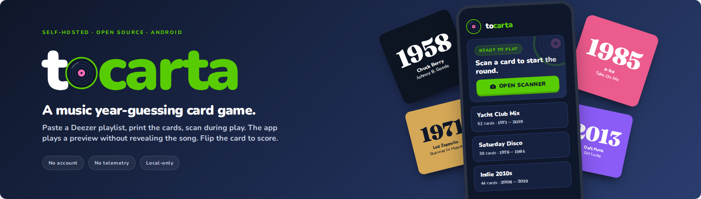

<div align="center">
    
    
    
</div>
<br />
<div align="center"><strong>A music year-guessing card game built on your own Deezer playlists</strong></div>
<div align="center">Print the deck. Scan a card to play the preview.<br/>Guess the year, flip the card to reveal.</div>
<br />
<div align="center">
  <sub>Built by <a href="https://github.com/damarals">Daniel Amaral</a></sub>
</div>

## Status

V1 in development. Android-only sideload. Not on the Play Store.

## How it works

Paste a public Deezer playlist URL. The app generates a printable PDF of QR cards for that playlist. During play, the player whose turn it is scans a card with the device camera, the app plays a 30-second preview of the track without showing the title, artist, year, or cover art on any screen, and players guess the year. The physical card is then flipped to reveal the answer. Scoring stays at the table; the app participates only in the audio layer.

## Install (sideload)

1. On your Android device, open **Settings → Apps → Special app access → Install unknown apps** and enable installation for the browser or file manager you will use to download the APK.
2. Open the [latest release](https://github.com/damarals/tocarta/releases/latest) on your device and download the APK.
3. (Optional but recommended) Verify the SHA-256 and the signing key fingerprint as described under [Verify](#verify).
4. Tap the downloaded APK to install. Confirm the install when prompted.
5. On first launch, grant camera permission. The camera is used only to scan cards.

**Compatibility:** Android 12+ (API level 31+).

## Verify

Each release publishes a SHA-256 of the APK in the release notes on the [Releases page](https://github.com/damarals/tocarta/releases). On your computer:

```bash
shasum -a 256 tocarta-vX.Y.Z.apk
```

The output must match the value in the release notes. If it does not, do not install the APK; download it again from the Releases page.

## Build from source

For local development:

```bash
git clone https://github.com/damarals/tocarta.git
cd tocarta
npm install
npx expo run:android
```

For a production-signed APK (requires an EAS account and the project's signing key):

```bash
eas build --platform android --profile production
```

See [`eas.json`](./eas.json) for the build profiles.

## Privacy

No account, no login, no telemetry. Your playlist URLs and decks live only on the device. Deezer and MusicBrainz are contacted directly from the app for track and year resolution; no third party sees that traffic.

Decks are stored in local app storage. Uninstalling the app deletes them. Export the PDF if you want to keep a deck across reinstalls.

## License

MIT. See [LICENSE](./LICENSE).

## Acknowledgements

Inspired by the commercial card game Hitster. Tocarta is independent and is not affiliated with or endorsed by Hitster or its publisher.

## Disclaimer

_Unofficial, independent, fan-made tool for personal non-commercial use. Not affiliated with, endorsed by, or connected to Hitster, Koninklijke Jumbo, Spotify, Deezer, or any related entities. All trademarks belong to their respective owners._
